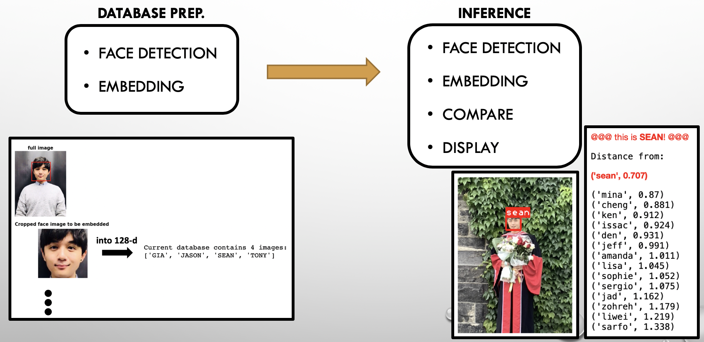

# Insight_workshop: face recognition system using OpenFace (Google FaceNet)
Thie repository contains a tutorial iPython Notebook ([OpenFace_Workshop.ipynb](https://github.com/sungsujaing/Insight_workshop/blob/master/OpenFace_Workshop.ipynb)) to build a basic face recognition system using OpenFace, a Python implementation of [FaceNet](https://www.cv-foundation.org/openaccess/content_cvpr_2015/app/1A_089.pdf) (Google). For more detailed information about this model, please refer to my article, [***HERE***](https://github.com/sungsujaing/Artificial_Intelligence_articles_and_tutorials/blob/master/Articles/Face%20recognition%20using%20OpenFace.md).

In order to replicate the results, please create a virtual environment and use the recommended modules as described below. 

## Note

* The pre-built Insight image database is provided as ***'insight_embedding.pkl'*** based on the pictures provided by Insight colleagues. Colleague pictures are not included in this repository, but only the vector representations of them. In order to use this database, simply load this pickle file as instructed in the main jupyter notebook.
* In order to create your own image database, create a folder named ***'image_database'*** in the main directory and place your images there. Then, follow the instruction provided in the main jupyter notebook. It is recommended that each database image is properly named.
* For testing your own image, place your testing images in the folder named ***'test'*** and follow the instruction provided in the main jupyter notebook.

## Virtual environment
### Create new virtual environment with python version 3.6.9
`conda create -n YOUR_VIRTUAL_ENVIRONMENT_NAME python==3.6.9`

### Activate
`conda activate YOUR_VIRTUAL_ENVIRONMENT_NAME`

### Install the required modules
`pip install -r requirements.txt`

### (Optional) in case you would like to remove the created virtual environment 
`conda remove -n YOUR_VIRTUAL_ENVIRONMENT_NAME --all`

## Database preparation

## How it works

