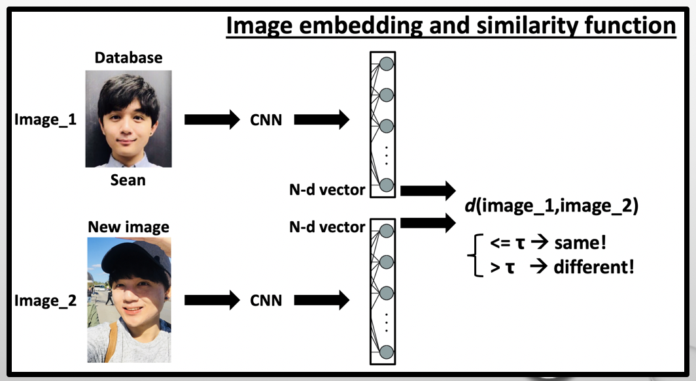

# Insight_workshop: basic face recognition system using OpenFace
Thie repository contains a tutorial iPython Notebook ([OpenFace_Workshop.ipynb](https://github.com/sungsujaing/Insight_workshop/blob/master/OpenFace_Workshop.ipynb)) to build basic face recognition system using OpenFace. In order to replicate the results, please follow the instruction below.

OpenFace is a Pytnon implementation of [FaceNet](https://www.cv-foundation.org/openaccess/content_cvpr_2015/app/1A_089.pdf) (Google). For more detailed information about this model, please refer to my article, [***HERE***](https://github.com/sungsujaing/Artificial_Intelligence_articles_and_tutorials/blob/master/Articles/Face%20recognition%20using%20OpenFace.md).

## Virtual environment
### Create new virtual environment with python version 3.6.9
`conda create -n YOUR_VIRTUAL_ENVIRONMENT_NAME python==3.6.9`
### Activate
`conda activate YOUR_VIRTUAL_ENVIRONMENT_NAME`
### Install the required modules
`pip install -r requirements.txt`
### (Optional) in case you would like to remove the created virtual environment 
`conda remove -n YOUR_VIRTUAL_ENVIRONMENT_NAME --all`

